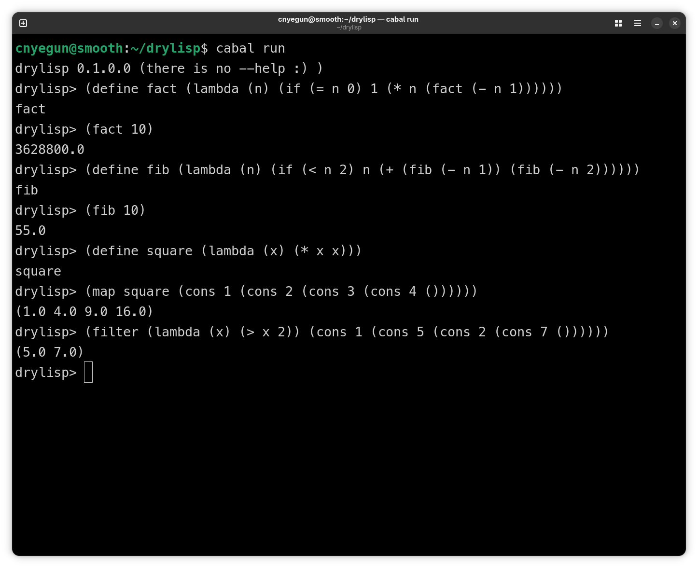

# DryLisp

A small Lisp interpreter written in Haskell. This was a learning project to understand how parser and interpreters work.



## What It Does

DryLisp can evaluate basic Lisp expressions including:

- **`(1)`** Atomic expression like numbers, strings, and true/false
- **`(2)`** Variables (identifier)
- **`(3)`** If statements
- **`(4)`** Lambda functions with closures
- **`(5)`** Let, let*, and letrec for create a local environment
- **`(6)`** Define for naming stuff
- **`(7)`** Some build in functions like +, -, *, cons, car, cdr
- **`(8)`** Higher-order functions: map, filter, fold, length, append, reverse

## Example Usage

### 1. Use the REPL
`cabal run`

### 2. If you want to use it as a module: 
```haskell
import DryLisp
import LispParser

main :: IO ()
main = do
    let input = "(+ 1 2 3)"
    case parse lispExprP input of
        Just (expr, _) -> print $ eval initialEnv expr
        Nothing        -> putStrLn "Parse error"
```
### Closure

Closures capture their environment.
```haskell
LispClosure
    { closureEnv :: Env
    , closureFn :: [LispExpr] -> Either ErrorMsg (Env, LispExpr) }
```

## The Parser

The parser is built from scratch using applicative functor combinators.

## License

GNU GPLv3
